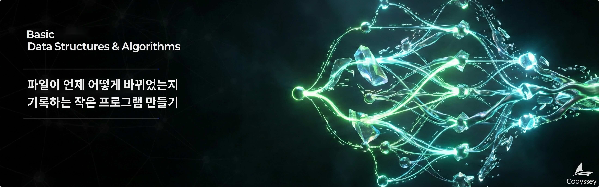

# B3-2: 파일이 언제 어떻게 바뀌었는지 기록하는 작은 프로그램 만들기

## 📋 과제 정보

| 항목 | 내용 |
|------|------|
| **과목** | 자료구조와 알고리즘 (Data Structures & Algorithms) |
| **난이도** | ★★☆ (Lv.2) |
| **학습 시간** | 80분 |
| **필수 여부** | ✅ 필수 |
| **진행 상태** | PASS |
| **과제 번호** | 185009 |

---

## 🎯 미션 설명



---

## 🛠️ 개발 환경

### 6\. 개발 환경

*   Python 3.10 이상

---

## ⚠️ 제약 사항

### 7\. 제약 사항

*   **실행**
    *   실행 커맨드(예): `python main.py`
*   **라이브러리 제한**
    *   그래프 전용 라이브러리 사용 금지
    *   정렬 관련 표준 API 전부 금지: `sorted()`, `list.sort()` 등
    *   기본 자료형(예: `list`, `dict`, `set`)과 문자열/파일 입출력/시간 처리는 사용 가능
*   **구조/품질**
    *   알고리즘 로직(탐색/정렬/인덱싱)은 독립된 함수 또는 클래스로 분리한다.
    *   주요 함수/클래스에 주석 또는 docstring을 작성한다.
*   **기능 범위**
    *   파일 내용 추적은 구현하지 않는다(커밋 메타데이터 중심).
    *   네트워크 통신은 구현하지 않는다.
    *   데이터 영속성(파일 저장)은 구현하지 않아도 된다(메모리 상 동작으로 충분).

---

## 📝 결과 예시

### 8\. 결과 예시

아래는 정답이 아니라 참고 예시다. 실제 문구와 디자인은 달라도 된다.

*   실행 예시(예시)
    
    ```css
    mini-git> init "Alice"
    Initialized repository.
    Current branch: main
    Current user: Alice
    
    mini-git> commit "Initial commit"
    [main a1b2c3] Initial commit
    
    mini-git> branch feature
    Created branch: feature
    
    mini-git> switch feature
    Switched to branch: feature
    
    mini-git> commit "Add login feature"
    [feature d4e5f6] Add login feature
    
    mini-git> switch main
    Switched to branch: main
    
    mini-git> commit "Add payment feature"
    [main g7h8i9] Add payment feature
    
    mini-git> log
    commit a1b2c3 (Alice, 2024-01-15 09:00:00) [main]
    Initial commit
    commit d4e5f6 (Alice, 2024-01-15 09:15:00) [feature]
    Add login feature
    commit g7h8i9 (Alice, 2024-01-15 09:30:00) [main]
    Add payment feature
    
    mini-git> path a1b2c3 g7h8i9
    Path: a1b2c3 -> g7h8i9
    
    mini-git> search "login"
    Found 1 commit:
    
    - d4e5f6: Add login feature
    
    mini-git> log --sort-by=author
    commit a1b2c3 (Alice, 2024-01-15 09:00:00)
    Initial commit
    commit d4e5f6 (Alice, 2024-01-15 09:15:00)
    Add login feature
    commit g7h8i9 (Alice, 2024-01-15 09:30:00)
    Add payment feature
    ```

---

## 📊 평가 정보

- 평가 대상: 예

---

> *이 문서는 Codyssey AI/SW 기초 과정의 과제 내용을 기반으로 자동 생성되었습니다.*
